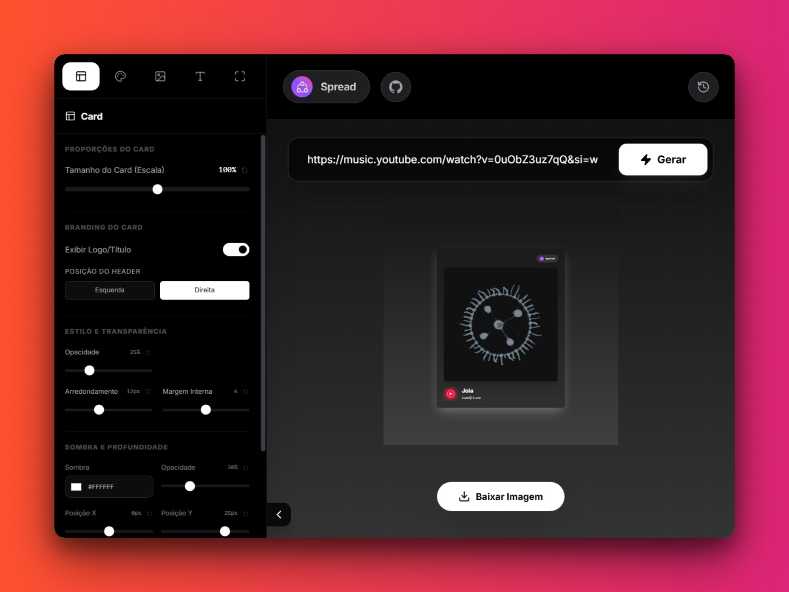
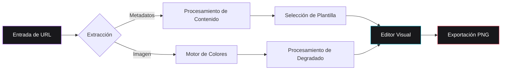
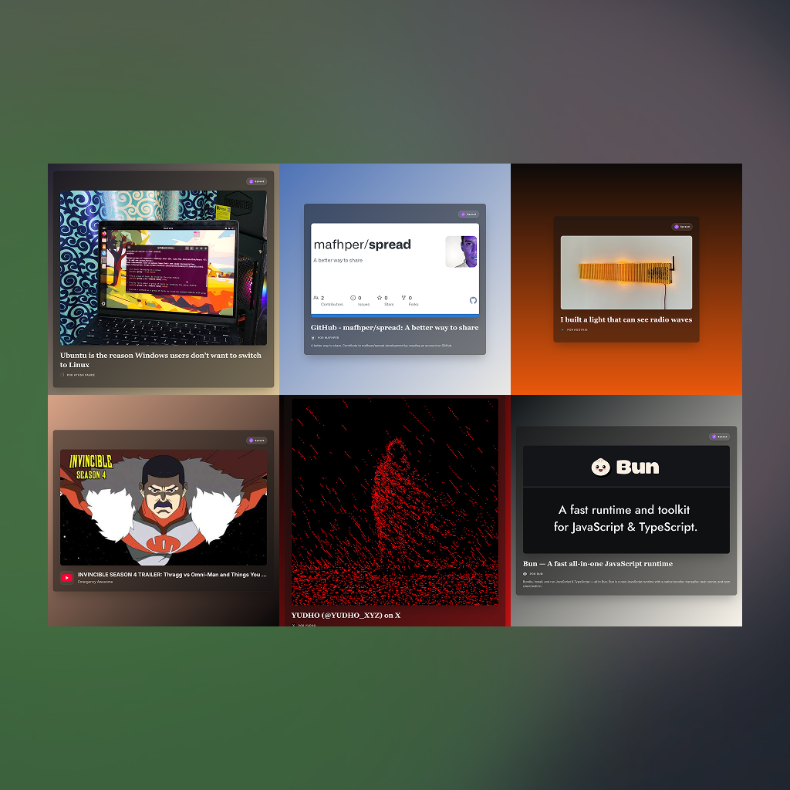

# Spread

Spread es una aplicación web de alto rendimiento diseñada para la creación de tarjetas estéticas de visualización de enlaces. La plataforma permite a los usuarios transformar URLs de diversos servicios —incluyendo plataformas de música, redes sociales y portales de noticias— en activos visuales profesionales, optimizados para el intercambio social.



<div align="center">

[English](README.md) • [Português](README-ptBR.md) • [Español](README-es.md)

[](https://mafhper.github.io/spread)
[](LICENSE)
[](https://bun.sh)

</div>

---

## Funcionalidades Técnicas

- **Extracción Automatizada de Metadatos**: Utiliza protocolos Open Graph para recuperar títulos, descripciones e imágenes de alta calidad a partir de las URLs proporcionadas.
- **Análisis Inteligente de Colores**: Implementa un motor dedicado para la extracción de paletas cromáticas dominantes de las imágenes de origen, generando automáticamente degradados de fondo armoniosos.
- **Plantillas Especializadas**: Presenta configuraciones de diseño adaptativas y optimizadas para contenidos musicales, fotografías y artículos periodísticos.
- **Configuración Visual Avanzada**: Ofrece un editor de nivel profesional con soporte para glassmorphism, degradados de neón y controles exhaustivos de tipografía.
- **Exportación en Alta Resolución**: Utiliza los frameworks Astro 5 y React 19 para ofrecer una interfaz receptiva y exportaciones en formato PNG con una proporción de píxeles de 2x.

---

## Flujo Arquitectónico

La aplicación opera íntegramente en el lado del cliente (client-side), garantizando la privacidad de los datos y la agilidad en la ejecución.



---

## Ejemplos Visuales


*Nota: Ejemplos de plantillas específicas para contenidos musicales y redes sociales.*

---

## Entorno de Desarrollo

El ciclo de vida del proyecto se gestiona a través del runtime **Bun**.

### Requisitos Previos

Asegúrese de que el runtime [Bun](https://bun.sh) esté debidamente instalado en el sistema.

### Instalación y Ejecución

```bash
# Instalación de las dependencias del proyecto
bun install

# Ejecución del servidor de desarrollo
bun dev

# Generación de la versión de producción
bun run build
```

---

## Estructura de Directorios

```text
spread/
├── src/
│   ├── components/      # Componentes modulares de interfaz en React
│   ├── store/           # Gestión de estado global mediante Zustand
│   ├── services/        # Integración de APIs y lógica de utilidades
│   └── styles/          # CSS global y configuraciones de Tailwind 4
├── docs/
│   └── assets/          # Medios y activos de la documentación
├── public/              # Activos estáticos y recursos de marca
└── Astro.config.mjs     # Configuración del framework
```

---

## Licencia

Este software se distribuye bajo la Licencia MIT. Consulte el archivo `LICENSE` para obtener información legal detallada.

---

<div align="center">
  <p>Mantenido por <b>mafhper</b></p>
  <a href="https://github.com/mafhper">
    
  </a>
</div>
