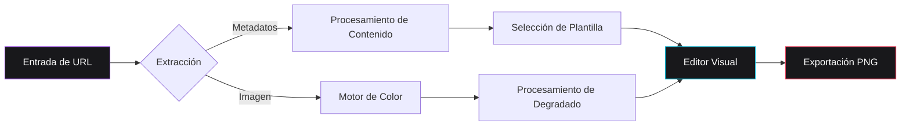

# Spread

Spread es una utilidad web de alta fidelidad diseñada para la generación de activos estéticos de visualización de enlaces. Facilita la transformación de URLs de diversas plataformas digitales —incluyendo servicios de streaming, redes sociales y portales de noticias— en componentes visuales profesionales optimizados para su distribución en alta resolución.


<div align="center">

[English](README.md) • [Português](README-ptBR.md) • [Español](README-es.md)

[](https://mafhper.github.io/spread)
[](LICENSE)
[](https://bun.sh)

</div>

---

## Visión General Técnica

- **Orquestación de Metadatos**: Implementa la extracción automatizada mediante protocolos Open Graph para la recuperación de títulos canónicos, descripciones e iconografía de alta calidad.
- **Motor de Color Heurístico**: Utiliza un módulo de análisis especializado para derivar paletas de colores dominantes de los medios de origen, generando degradados cromáticos equilibrados.
- **Plantillas de Diseño Adaptativas**: Presenta un conjunto de configuraciones especializadas optimizadas para diversos tipos de contenido, incluyendo música, fotografía y periodismo.
- **Renderizado de Alta Resolución**: Desarrollado sobre Astro 6 y React 19, ofreciendo una interfaz de baja latencia con soporte para la exportación de activos PNG en una proporción de píxeles de 2x.

---

## Evaluación en Línea

El despliegue de producción está disponible para pruebas y evaluación en vivo.

**Punto de Acceso:** [mafhper.github.io/spread](https://mafhper.github.io/spread)

1.  **Despliegue**: Accesible a través de cualquier navegador web moderno estándar.
2.  **Uso**: Ingrese URLs válidas de plataformas compatibles (Spotify, YouTube, Portales de Noticias).
3.  **Gobernanza**: Los comentarios y reportes de errores deben enviarse a través de [GitHub Issues](https://github.com/mafhper/spread/issues).

---

## Garantía de Calidad

Spread usa un flujo compacto de validación basado en los scripts raíz del proyecto y en GitHub Actions.

- **Gate local**: `bun run check` ejecuta ESLint, TypeScript, Prettier y Vitest.
- **Preflight de CI**: `bun run preflight:github` agrega cobertura y auditoría npm para severidad alta.
- **Hooks Git**: Husky ejecuta `check` antes de commits y `preflight:github` antes de pushes.
- **Automatización GitHub**: `quality.yml` valida PRs y pushes, `dependency-guard.yml` revisa cambios de dependencias, `deploy.yml` publica GitHub Pages desde `main`, y Dependabot sigue actualizaciones de GitHub Actions.

---

## Flujo Arquitectónico

La aplicación se ejecuta exclusivamente en el lado del cliente (client-side) para garantizar la máxima privacidad de los datos y eficiencia computacional.



---

## Referencia Visual


_Figura 1: Configuraciones de diseño especializadas para metadados musicales._


_Figura 2: Plantillas de nivel profesional para distribución en redes sociales._

---

## Desarrollo y Despliegue

El proyecto soporta un **flujo cross-platform** (Windows, macOS, Linux) y puede ejecutarse con **Bun** (recomendado) o **Node/npm**. Los scripts evitan comandos dependientes del shell.

### Requisitos Previos

- [Node.js](https://nodejs.org) >= 22.13.0 (obligatorio)
- [npm](https://www.npmjs.com) >= 10
- [Bun Runtime](https://bun.sh) >= 1.1 (recomendado)

### Flujo Universal (Bun o Node)

```bash
# Sincronización de dependencias para desarrollo local (elige uno)
bun install
# o
npm install

# Instalación determinística para validación estilo CI (elige uno)
bun install --frozen-lockfile
# o
npm ci

# Servidor de desarrollo
bun run dev
# o
npm run dev

# Build de producción
bun run build
# o
npm run build
```

### Validación

```bash
# Chequeos locales rápidos
bun run check

# Preflight de CI con cobertura y auditoría de seguridad
bun run preflight:github

# Build con chequeos locales y auditoría de seguridad
bun run validate
```

---

## Estructura del Repositorio

```text
spread/
├── .github/workflows/  # Validación de CI y despliegue en GitHub Pages
├── src/
│   ├── components/      # Arquitectura de interfaz React
│   ├── store/           # Sincronización de estado mediante Zustand
│   ├── services/        # Utilidades lógicas y abstracción de API
│   └── styles/          # Configuración de PostCSS y Tailwind 4
├── tests/               # Cobertura unitaria Vitest para comportamiento del producto
├── public/              # Activos estáticos y recursos de distribución
└── astro.config.mjs     # Orquestación del framework
```

---

## Licencia

Este proyecto está bajo la Licencia MIT. Los términos legales detallados están disponibles en el archivo [LICENSE](LICENSE).

---

<div align="center">
  <p>Mantenido por <b>mafhper</b></p>
  <a href="https://github.com/mafhper">
    
  </a>
</div>
