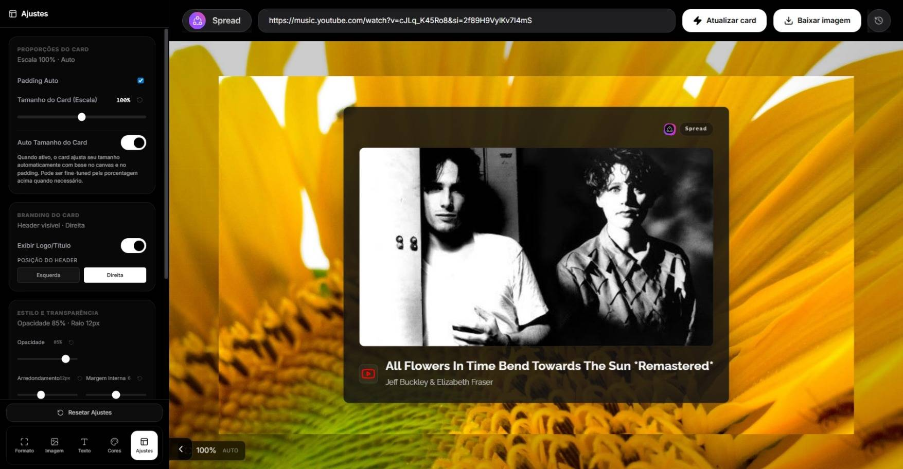
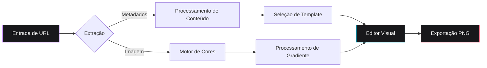
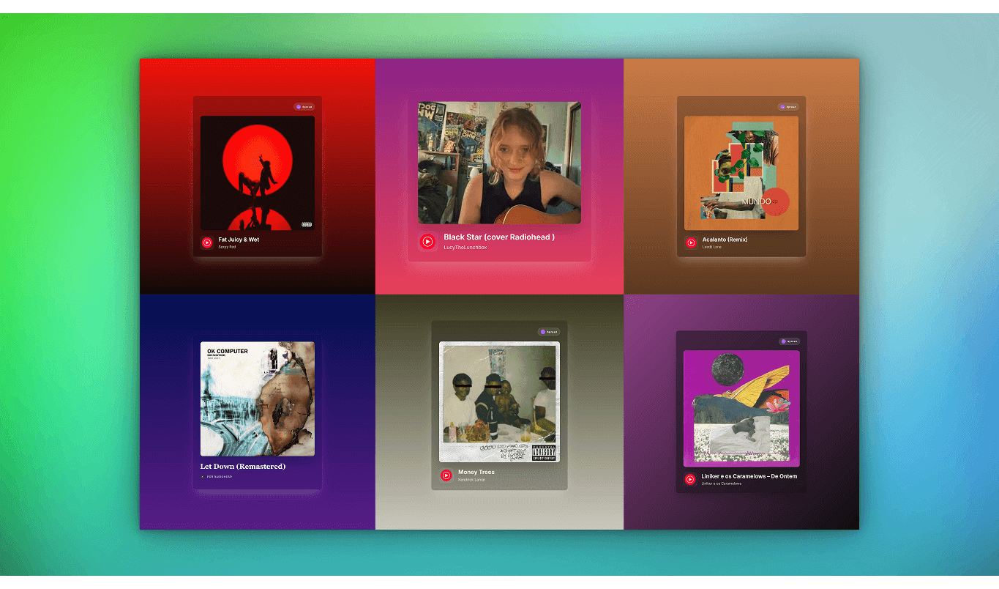
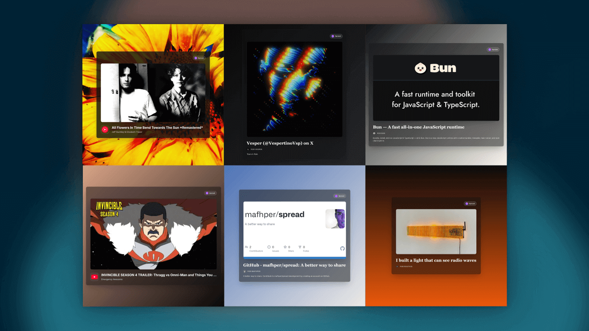

# Spread

Spread é um utilitário web de alta fidelidade projetado para a geração de ativos estéticos de visualização de links. A plataforma facilita a transformação de URLs de diversas fontes digitais — incluindo serviços de streaming, redes sociais e portais de notícias — em componentes visuais profissionais otimizados para distribuição em alta resolução.



<div align="center">

[English](README.md) • [Português](README-ptBR.md) • [Español](README-es.md)

[](https://mafhper.github.io/spread)
[](LICENSE)
[](https://bun.sh)

</div>

---

## Visão Geral Técnica

- **Orquestração de Metadados**: Implementa a extração automatizada via protocolos Open Graph para recuperação de títulos canônicos, descrições e iconografia de alta qualidade.
- **Motor de Cores Heurístico**: Utiliza um módulo de análise especializado para derivar paletas de cores dominantes da mídia de origem, gerando gradientes cromáticos equilibrados.
- **Templates de Layout Adaptativos**: Apresenta um conjunto de configurações especializadas otimizadas para diversos tipos de conteúdo, incluindo música, fotografia e jornalismo.
- **Renderização de Alta Resolução**: Desenvolvido sobre Astro 6 e React 19, entregando uma interface de baixa latência com suporte para exportação de ativos PNG em proporção de pixels de 2x.

---

## Avaliação Online

A implantação de produção está disponível para testes e avaliação em tempo real.

**Ponto de Acesso:** [mafhper.github.io/spread](https://mafhper.github.io/spread)

1.  **Implantação**: Acessível através de qualquer navegador web moderno padrão.
2.  **Uso**: Insira URLs válidas de plataformas suportadas (Spotify, YouTube, Portais de Notícias).
3.  **Governança**: Feedbacks e relatórios de bugs devem ser submetidos via [GitHub Issues](https://github.com/mafhper/spread/issues).

---

## Garantia de Qualidade

O Spread usa um fluxo compacto de validação baseado nos scripts raiz do projeto e no GitHub Actions.

- **Gate local**: `bun run check` executa ESLint, TypeScript, Prettier e Vitest.
- **Preflight de CI**: `bun run preflight:github` adiciona cobertura e auditoria npm para severidade alta.
- **Hooks Git**: Husky executa `check` antes de commits e `preflight:github` antes de pushes.
- **Automação GitHub**: `quality.yml` valida PRs e pushes, `dependency-guard.yml` revisa mudanças de dependências, `deploy.yml` publica o GitHub Pages a partir da `main`, e o Dependabot acompanha atualizações de GitHub Actions.

---

## Fluxo Arquitetural

A aplicação é executada exclusivamente no lado do cliente (client-side) para garantir a máxima privacidade dos dados e eficiência computacional.



---

## Referência Visual


_Figura 1: Configurações de layout especializadas para metadados musicais._


_Figura 2: Templates de nível profissional para distribuição em redes sociais._

---

## Desenvolvimento e Implantação

O projeto suporta um **fluxo cross-platform** (Windows, macOS, Linux) e pode ser executado com **Bun** (recomendado) ou **Node/npm**. Os scripts evitam comandos dependentes de shell.

### Pré-requisitos

- [Node.js](https://nodejs.org) >= 22.13.0 (obrigatório)
- [npm](https://www.npmjs.com) >= 10
- [Bun Runtime](https://bun.sh) >= 1.1 (recomendado)

### Fluxo Universal (Bun ou Node)

```bash
# Sincronização de dependências para desenvolvimento local (escolha um)
bun install
# ou
npm install

# Instalação determinística para validação estilo CI (escolha um)
bun install --frozen-lockfile
# ou
npm ci

# Servidor de desenvolvimento
bun run dev
# ou
npm run dev

# Build de produção
bun run build
# ou
npm run build
```

### Validação

```bash
# Checagens locais rápidas
bun run check

# Preflight de CI com cobertura e auditoria de segurança
bun run preflight:github

# Build com checagens locais e auditoria de segurança
bun run validate
```

---

## Estrutura do Repositório

```text
spread/
├── .github/workflows/  # Validação de CI e deploy no GitHub Pages
├── src/
│   ├── components/      # Arquitetura de interface React
│   ├── store/           # Sincronização de estado via Zustand
│   ├── services/        # Utilitários de lógica e abstração de API
│   └── styles/          # Configuração PostCSS e Tailwind 4
├── tests/               # Cobertura unitária Vitest para comportamento do produto
├── public/              # Ativos estáticos e recursos de distribuição
└── astro.config.mjs     # Orquestração do framework
```

---

## Licença

Este projeto está licenciado sob a Licença MIT. Termos legais detalhados estão disponíveis no arquivo [LICENSE](LICENSE).

---

<div align="center">
  <p>Mantido por <b>mafhper</b></p>
  <a href="https://github.com/mafhper">
    
  </a>
</div>
