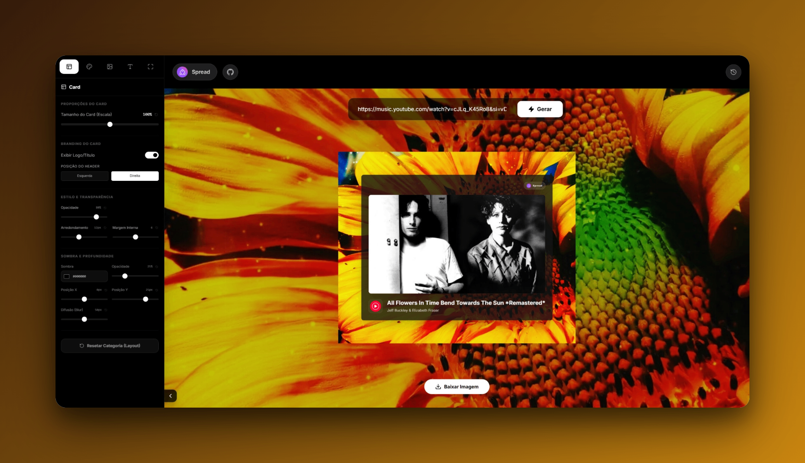
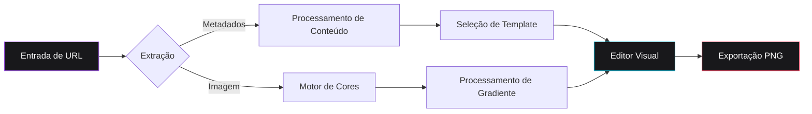
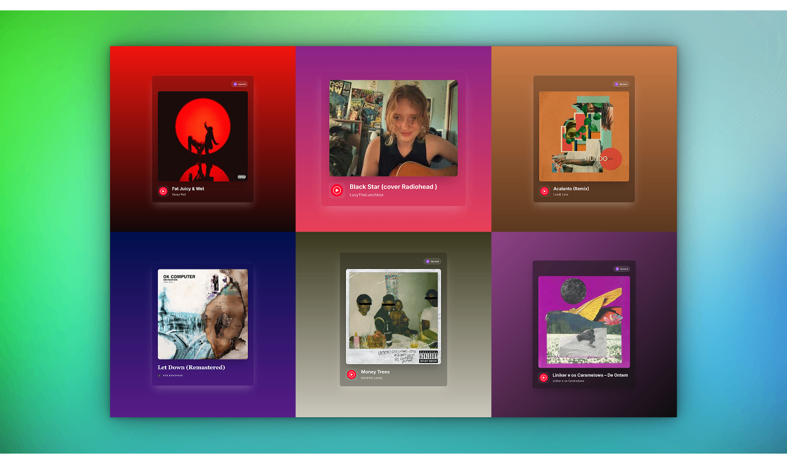
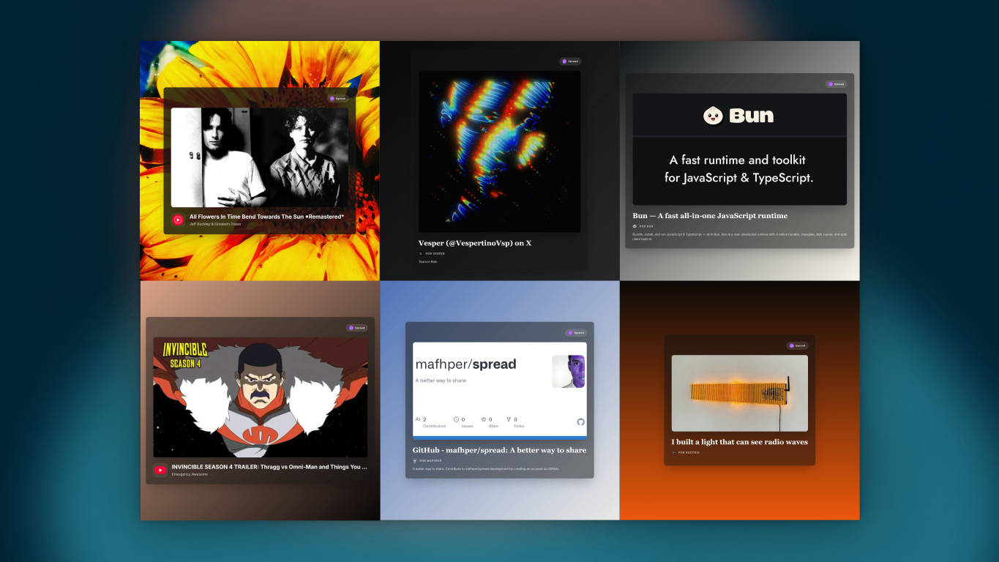

# Spread

Spread é um utilitário web de alta fidelidade projetado para a geração de ativos estéticos de visualização de links. A plataforma facilita a transformação de URLs de diversas fontes digitais — incluindo serviços de streaming, redes sociais e portais de notícias — em componentes visuais profissionais otimizados para distribuição em alta resolução.



<div align="center">

[English](README.md) • [Português](README-ptBR.md) • [Español](README-es.md)

[](https://mafhper.github.io/spread)
[](LICENSE)
[](https://bun.sh)

</div>

---

## Visão Geral Técnica

- **Orquestração de Metadados**: Implementa a extração automatizada via protocolos Open Graph para recuperação de títulos canônicos, descrições e iconografia de alta qualidade.
- **Motor de Cores Heurístico**: Utiliza um módulo de análise especializado para derivar paletas de cores dominantes da mídia de origem, gerando gradientes cromáticos equilibrados.
- **Templates de Layout Adaptativos**: Apresenta um conjunto de configurações especializadas otimizadas para diversos tipos de conteúdo, incluindo música, fotografia e jornalismo.
- **Renderização de Alta Resolução**: Desenvolvido sobre Astro 5 e React 19, entregando uma interface de baixa latência com suporte para exportação de ativos PNG em proporção de pixels de 2x.

---

## Avaliação Online

A implantação de produção está disponível para testes e avaliação em tempo real.

**Ponto de Acesso:** [mafhper.github.io/spread](https://mafhper.github.io/spread)

1.  **Implantação**: Acessível através de qualquer navegador web moderno padrão.
2.  **Uso**: Insira URLs válidas de plataformas suportadas (Spotify, YouTube, Portais de Notícias).
3.  **Governança**: Feedbacks e relatórios de bugs devem ser submetidos via [GitHub Issues](https://github.com/mafhper/spread/issues).

---

## Garantia de Qualidade e Governança

O Spread integra o **Quality Core**, um sistema de governança modular projetado para impor padrões rigorosos de engenharia de software através de auditoria automatizada.

- **Quality Gate**: Orquestrador pre-commit que impõe protocolos de integridade, internacionalização (i18n), segurança e performance.
- **Dashboard de Telemetria**: Interface analítica em estilo Bento para monitoramento em tempo real da saúde do projeto, tendências históricas e snapshots de auditoria.
- **Segurança e Performance**: Integração nativa com métricas Lighthouse e scanners especializados de dependências e segredos.

A documentação técnica está disponível no [Módulo Quality Core](quality-core/README.md).

---

## Fluxo Arquitetural

A aplicação é executada exclusivamente no lado do cliente (client-side) para garantir a máxima privacidade dos dados e eficiência computacional.



---

## Referência Visual


_Figura 1: Configurações de layout especializadas para metadados musicais._


_Figura 2: Templates de nível profissional para distribuição em redes sociais._

---

## Desenvolvimento e Implantação

O ciclo de vida do projeto é gerenciado através do runtime **Bun**.

### Pré-requisitos

- [Bun Runtime](https://bun.sh) (Ambiente recomendado)

### Execução Local

```bash
# Sincronização de dependências
bun install

# Inicialização do servidor de desenvolvimento
bun dev

# Geração do build de produção
bun run build
```

---

## Estrutura do Repositório

```text
spread/
├── src/
│   ├── components/      # Arquitetura de interface React
│   ├── store/           # Sincronização de estado via Zustand
│   ├── services/        # Utilitários de lógica e abstração de API
│   └── styles/          # Configuração PostCSS e Tailwind 4
├── quality-core/        # Sistema de garantia de qualidade e governança
├── public/              # Ativos estáticos e recursos de distribuição
└── Astro.config.mjs     # Orquestração do framework
```

---

## Licença

Este projeto está licenciado sob a Licença MIT. Termos legais detalhados estão disponíveis no arquivo [LICENSE](LICENSE).

---

<div align="center">
  <p>Mantido por <b>mafhper</b></p>
  <a href="https://github.com/mafhper">
    
  </a>
</div>
