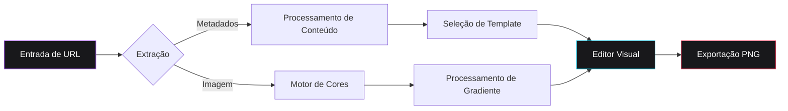

# Spread

Spread é uma aplicação web de alta performance voltada para a criação de cards estéticos de visualização de links. A plataforma permite que usuários transformem URLs de diversos serviços — incluindo plataformas de música, redes sociais e portais de notícias — em ativos visuais profissionais, otimizados para compartilhamento social.


<div align="center">

[English](README.md) • [Português](README-ptBR.md) • [Español](README-es.md)

[](https://mafhper.github.io/spread)
[](LICENSE)
[](https://bun.sh)

</div>

---

## Funcionalidades Técnicas

- **Extração Automatizada de Metadados**: Utiliza protocolos Open Graph para recuperar títulos, descrições e imagens de alta qualidade a partir de URLs fornecidas.
- **Análise Inteligente de Cores**: Implementa um motor dedicado para extração de paletas cromáticas dominantes de imagens de origem, gerando automaticamente gradientes de fundo harmoniosos.
- **Templates Especializados**: Possui configurações de layout adaptativas e otimizadas para conteúdos musicais, fotografias e artigos jornalísticos.
- **Configuração Visual Avançada**: Oferece um editor de nível profissional com suporte a glassmorphism, gradientes neon e controles abrangentes de tipografia.
- **Exportação em Alta Resolução**: Utiliza os frameworks Astro 5 e React 19 para entregar uma interface responsiva e exportações em formato PNG com proporção de pixels de 2x.

---

## Fluxo Arquitetural

A aplicação opera integralmente no lado do cliente (client-side), garantindo a privacidade dos dados e agilidade na execução.



---

## Exemplos Visuais


_Nota: Exemplos de templates específicos para conteúdos musicais._


_Nota: Exemplos de templates específicos para conteúdos de redes sociais._

---

## Ambiente de Desenvolvimento

O ciclo de vida do projeto é gerenciado através do runtime **Bun**.

### Pré-requisitos

Certifique-se de que o runtime [Bun](https://bun.sh) esteja devidamente instalado no sistema.

### Instalação e Execução

```bash
# Instalação das dependências do projeto
bun install

# Execução do servidor de desenvolvimento
bun dev

# Geração da versão de produção
bun run build
```

---

## Estrutura de Diretórios

```text
spread/
├── src/
│   ├── components/      # Componentes modulares de interface em React
│   ├── store/           # Gerenciamento de estado global via Zustand
│   ├── services/        # Integração de APIs e lógica de utilitários
│   └── styles/          # CSS global e configurações do Tailwind 4
├── docs/
│   └── assets/          # Mídias e ativos da documentação
├── public/              # Ativos estáticos e recursos de marca
└── Astro.config.mjs     # Configuração do framework
```

---

## Licença

Este software é distribuído sob a Licença MIT. Consulte o arquivo `LICENSE` para informações jurídicas detalhadas.

---

<div align="center">
  <p>Mantido por <b>mafhper</b></p>
  <a href="https://github.com/mafhper">
    
  </a>
</div>
