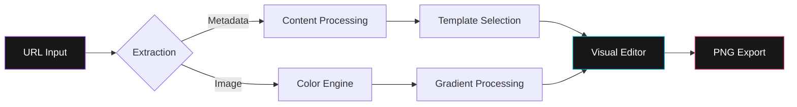

# Spread

Spread is a high-performance web application designed for the creation of aesthetic link visualization cards. It enables users to transform URLs from various platforms—including music services, social media, and news outlets—into professionally styled visual assets optimized for social sharing.


<div align="center">

[English](README.md) • [Português](README-ptBR.md) • [Español](README-es.md)

[](https://mafhper.github.io/spread)
[](LICENSE)
[](https://bun.sh)

</div>

---

## Technical Features

- **Automated Metadata Extraction**: Utilizes Open Graph protocols to retrieve titles, descriptions, and high-quality imagery from provided URLs.
- **Intelligent Color Analysis**: Implements a dedicated engine to extract dominant color palettes from source images, automatically generating harmonious background gradients.
- **Specialized Templates**: Features adaptive layout configurations optimized for music content, photography, and journalistic articles.
- **Advanced Visual Configuration**: Provides a professional-grade editor with support for glassmorphism, neon gradients, and comprehensive typography controls.
- **High-Resolution Export**: Leverages the Astro 5 and React 19 frameworks to deliver a responsive interface and 2x pixel ratio PNG exports.

---

## Architectural Workflow

The application operates entirely on the client side to ensure data privacy and optimal execution speed.



---

## Visual Examples


_Note: Examples of platform-specific templates for music content._


_Note: Examples of platform-specific templates for social media content._

---

## Development Environment

The project lifecycle is managed via the **Bun** runtime.

### Prerequisites

Ensure the [Bun](https://bun.sh) runtime is installed on your system.

### Installation and Execution

```bash
# Install project dependencies
bun install

# Execute the development server
bun dev

# Generate a production build
bun run build
```

---

## Directory Structure

```text
spread/
├── src/
│   ├── components/      # Modular React interface components
│   ├── store/           # Global state management via Zustand
│   ├── services/        # API integration and utility logic
│   └── styles/          # Global CSS and Tailwind 4 configuration
├── docs/
│   └── assets/          # Documentation media and assets
├── public/              # Static assets and brand resources
└── Astro.config.mjs     # Framework configuration
```

---

## License

This software is distributed under the MIT License. Refer to the `LICENSE` file for detailed legal information.

---

<div align="center">
  <p>Maintained by <b>mafhper</b></p>
  <a href="https://github.com/mafhper">
    
  </a>
</div>
