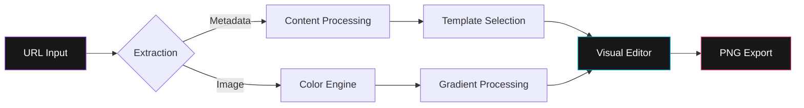

# Spread

Spread is a high-fidelity web utility engineered for the generation of aesthetic link visualization assets. It facilitates the transformation of URLs from diverse digital platforms—including streaming services, social media, and news outlets—into professionally styled visual components optimized for high-resolution distribution.


<div align="center">

[English](README.md) • [Português](README-ptBR.md) • [Español](README-es.md)

[](https://mafhper.github.io/spread)
[](LICENSE)
[](https://bun.sh)

</div>

---

## Technical Overview

- **Metadata Orchestration**: Implements automated Open Graph protocol extraction to retrieve canonical titles, descriptions, and high-quality iconography.
- **Heuristic Color Engine**: Leverages a specialized analysis module to derive dominant color palettes from source media, generating balanced chromatic gradients.
- **Adaptive Layout Templates**: Features a suite of specialized configurations optimized for varying content types, including music, photography, and journalism.
- **Layout Stability & UX**: Implements skeleton-based progressive loading and anchor-aware navigation to eliminate Cumulative Layout Shift (CLS) during content hydration.
- **High-Resolution Rendering**: Built on Astro 7 and React 19, delivering a low-latency interface with support for 2x pixel-ratio PNG asset exports.

---

## Live Evaluation

The production deployment is available for live testing and evaluation.

**Access Point:** [mafhper.github.io/spread](https://mafhper.github.io/spread)

1.  **Deployment**: Accessible via any standard modern web browser.
2.  **Usage**: Input valid URLs from supported platforms (Spotify, YouTube, News portals).
3.  **Governance**: Feedback and bug reports should be submitted via [GitHub Issues](https://github.com/mafhper/spread/issues).

---

## Quality Assurance

Spread uses a compact validation flow built from root project scripts and GitHub Actions.

- **Local gate**: `bun run check` runs ESLint, TypeScript, Prettier, and Vitest.
- **CI preflight**: `bun run preflight:github` adds coverage and a Bun high-severity audit.
- **Git hooks**: Husky runs `check` before commits and `preflight:github` before pushes.
- **GitHub automation**: `quality.yml` validates PRs and pushes, `dependency-guard.yml` reviews dependency changes, `deploy.yml` publishes GitHub Pages from `main`, `release.yml` creates GitHub Releases from `v*` tags, and Dependabot tracks Bun and GitHub Actions updates.

---

## Architectural Workflow

The application executes exclusively client-side to ensure maximum data privacy and computational efficiency.



---

## Visual Reference


_Figure 1: Specialized layout configurations for music-centric metadata._


_Figure 2: Professional-grade templates for social media distribution._

---

## Development & Deployment

The project supports a **cross-platform workflow** (Windows, macOS, Linux) and runs with **Bun**, the only supported package manager. Scripts are written to avoid shell-specific commands. The `bun.lock` file is the single source of truth; npm, Yarn, or pnpm lockfiles are rejected.

### Prerequisites

- [Bun](https://bun.sh) >= 1.3.13 (required)
- [Node.js](https://nodejs.org) >= 22.13.0 (required by the toolchain)

### Universal Flow

```bash
# Dependency synchronization for local development
bun install

# Deterministic install for CI-style validation
bun install --frozen-lockfile

# Development server
bun run dev

# Production build
bun run build
```

### Validation

```bash
# Fast local checks
bun run check

# CI preflight with coverage and security audit
bun run preflight:github

# Build plus local checks and security audit
bun run validate
```

---

## Releases

Spread publishes tagged releases automatically. Pushing a `vX.Y.Z` tag runs the `release.yml` workflow, which validates the version, runs the full quality suite, builds the site, and creates a GitHub Release with an image, manual notes and an auto-generated changelog.

```bash
git tag -a v1.0.0 -m "Release v1.0.0"
git push origin v1.0.0
```

The version in `package.json` must match the tag. Pushing to `main` does **not** create a Release.

- **Manual notes**: optional, in `.github/release-notes/vX.Y.Z.md` (see the [README](.github/release-notes/README.md)).
- **Changelog**: generated from merged PRs, categorized by `.github/release.yml`; dependency PRs are excluded.
- **Release image**: `docs/images/releases/release.webp` represents the current `major.minor` line; a new `major.minor` line requires updating the image before tagging.

---

## Repository Structure

```text
spread/
├── .github/workflows/  # CI validation, GitHub Pages and release automation
├── .github/release-notes/  # Per-version release notes (optional)
├── .github/release.yml # Changelog categories for GitHub Releases
├── src/
│   ├── components/      # React interface architecture
│   ├── store/           # State synchronization via Zustand
│   ├── services/        # Logic utilities and API abstraction
│   └── styles/          # PostCSS and Tailwind 4 configuration
├── tests/               # Vitest unit coverage for product behavior
├── public/              # Static assets and distribution resources
└── astro.config.mjs     # Framework orchestration
```

---

## License

This project is licensed under the MIT License. Detailed legal terms are available in the [LICENSE](LICENSE) file.

---

<div align="center">
  <p>Maintained by <b>mafhper</b></p>
  <a href="https://github.com/mafhper">
    
  </a>
</div>
