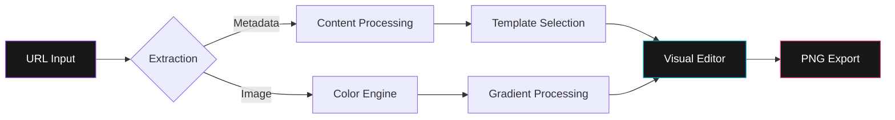

# Spread

Spread is a high-fidelity web utility engineered for the generation of aesthetic link visualization assets. It facilitates the transformation of URLs from diverse digital platforms—including streaming services, social media, and news outlets—into professionally styled visual components optimized for high-resolution distribution.


<div align="center">

[English](README.md) • [Português](README-ptBR.md) • [Español](README-es.md)

[](https://mafhper.github.io/spread)
[](LICENSE)
[](https://bun.sh)

</div>

---

## Technical Overview

- **Metadata Orchestration**: Implements automated Open Graph protocol extraction to retrieve canonical titles, descriptions, and high-quality iconography.
- **Heuristic Color Engine**: Leverages a specialized analysis module to derive dominant color palettes from source media, generating balanced chromatic gradients.
- **Adaptive Layout Templates**: Features a suite of specialized configurations optimized for varying content types, including music, photography, and journalism.
- **Layout Stability & UX**: Implements skeleton-based progressive loading and anchor-aware navigation to eliminate Cumulative Layout Shift (CLS) during content hydration.
- **High-Resolution Rendering**: Built on Astro 5 and React 19, delivering a low-latency interface with support for 2x pixel-ratio PNG asset exports.

---

## Live Evaluation

The production deployment is available for live testing and evaluation.

**Access Point:** [mafhper.github.io/spread](https://mafhper.github.io/spread)

1.  **Deployment**: Accessible via any standard modern web browser.
2.  **Usage**: Input valid URLs from supported platforms (Spotify, YouTube, News portals).
3.  **Governance**: Feedback and bug reports should be submitted via [GitHub Issues](https://github.com/mafhper/spread/issues).

---

## Quality Assurance & Governance

Spread integrates **Quality Core**, a modular governance system designed to enforce rigorous software engineering standards through automated auditing.

- **Quality Gate**: Pre-commit orchestrator enforcing integrity, internationalization (i18n), security, and performance protocols.
- **Telemetry Dashboard**: A Bento-grid analytical interface for real-time monitoring of project health, historical trends, and audit snapshots.
- **Security & Performance**: Native integration with Lighthouse metrics and specialized dependency/secret scanners.

Technical documentation is available in the [Quality Core Module](quality-core/README.md).

---

## Architectural Workflow

The application executes exclusively client-side to ensure maximum data privacy and computational efficiency.



---

## Visual Reference


_Figure 1: Specialized layout configurations for music-centric metadata._


_Figure 2: Professional-grade templates for social media distribution._

---

## Development & Deployment

The project lifecycle is managed via the **Bun** runtime.

### Prerequisites

- [Bun Runtime](https://bun.sh) (Recommended environment)

### Local Execution

```bash
# Dependency synchronization
bun install

# Development server initialization
bun dev

# Production build generation
bun run build
```

---

## Repository Structure

```text
spread/
├── src/
│   ├── components/      # React interface architecture
│   ├── store/           # State synchronization via Zustand
│   ├── services/        # Logic utilities and API abstraction
│   └── styles/          # PostCSS and Tailwind 4 configuration
├── quality-core/        # Quality assurance and governance system
├── public/              # Static assets and distribution resources
└── Astro.config.mjs     # Framework orchestration
```

---

## License

This project is licensed under the MIT License. Detailed legal terms are available in the [LICENSE](LICENSE) file.

---

<div align="center">
  <p>Maintained by <b>mafhper</b></p>
  <a href="https://github.com/mafhper">
    
  </a>
</div>
